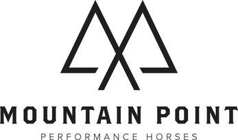
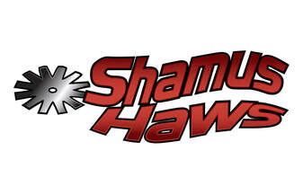
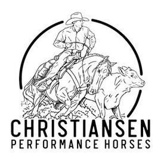
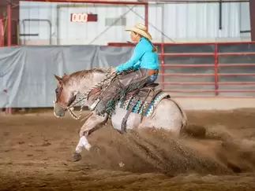

## Trainers Directory

## If you are in the market for a good trainer, check out the list below! Trainers listed on this page are subject to board approval. Prior to being added, trainers must be an active member of UVRHA, have shown in at least one show, and pay $100 sponsorship.

### Sammy Barbour

**Head Trainer:** Sammy Barbour

**Phone:** 801-209-7037

**Email:** [sammybarbour@gmail.com](mailto:sammybarbour@gmail.com)

**Location:** Bluffdale, UT

**Specializing in** the all around performance horses. Offering lessons, training and sales

---

### Bryan Hooley

**Head Trainer:** Bryan Hooley

**Phone:** 801-372-0204

**Email:** [hooleyperformancehorses@gmail.com](mailto:hooleyperformancehorses@gmail.com)

**Location:** Eagle Mountain, UT

**Specializing in** reining, reining working cow horses and versatility horse

---

### MM Show Horses

**Head Trainer:** Sandi Morgan, Paige Morgan and Rylee Morgan

**Phone Number:** 801-369-3619

**Email:** [mmshowhorses@gmail.com](mailto:mmshowhorses@gmail.com)

**Specializing in** all around performance horse training and sales.

---

### Shamus Haws

**Head Trainer:** Shamus Haws

**Phone:** 801-541-9229

**Email:** [shamushaws@gmail.com](mailto:shamushaws@gmail.com)

**Location:** Erda, UT

**Specializing in** the Versatility Ranch Horses. Offering clinics, private lessons, and training.

---

### McCoy Christiansen

**Head Trainer:** McCoy Christiansen

**Phone Number:** 801-516-8135

**Email:** [christiansenperformancehorses@gmail.com](mailto:christiansenperformancehorses@gmail.com)

**Website:** www.christiansenperformancehorses.com

**Specializing in:** Reined Cow Horse training and showing

---

### Dana Szegedy

**Head Trainer:** Dana Szegedy

**Phone:** 406-380-0516

**Email:** [dana@communequest.com](mailto:dana@communequest.com)

**Website:** www.communequest.com

**Location:** Oakley UT

**Specializing in** a balanced horse that has self carriage with soft feel and building a braver horse.
